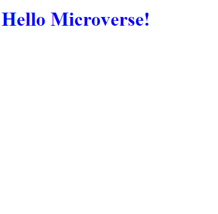

# Hello Microverse

> This project is about setting up linters and using gitflow.



Additional description about the project and its features.

## Built With

- HTML & CSS


## Getting Started

To get a local copy up and running follow these simple example steps.

### Prerequisites
vscode 
liveserver

### Setup

### Install
```
git clone git@github.com:Tobinchilongo/Hello-Microverse.git
```

### Run 
cd Hello-Microverse
open with live server


## Author

👤 **TOBIN CHILONGO JNR**

- GitHub: [https://github.com/Tobinchilongo](https://github.com/githubhandle)
- Twitter: [https://twitter.com/Tobin_Official](https://twitter.com/twitterhandle)
- LinkedIn: [https://www.linkedin.com/in/tobin-chilongo-a6736415a/](https://linkedin.com/in/linkedinhandle)


## 🤝 Contributing

Contributions, issues, and feature requests are welcome!

Feel free to check the [issues page](../../issues/).

## Show your support

Give a ⭐️ if you like this project!

## Acknowledgments

- Hat tip to anyone whose code was used
- Inspiration
- etc

## 📝 License

This project is [MIT](./MIT.md) licensed.
